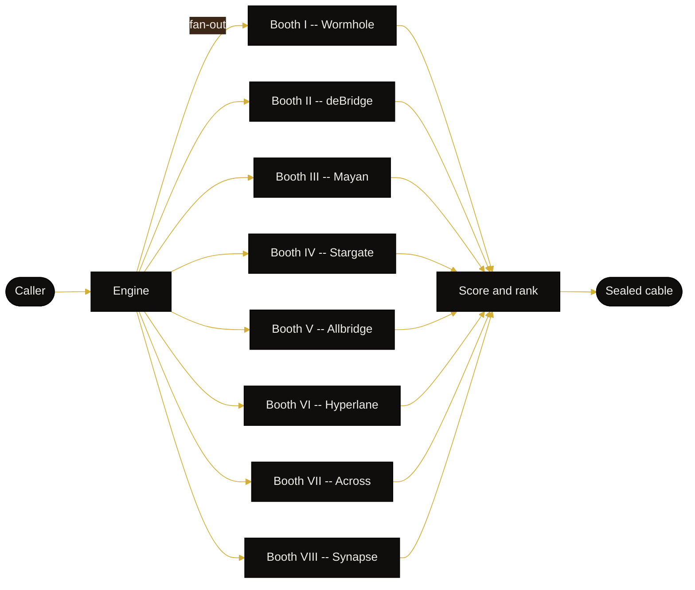
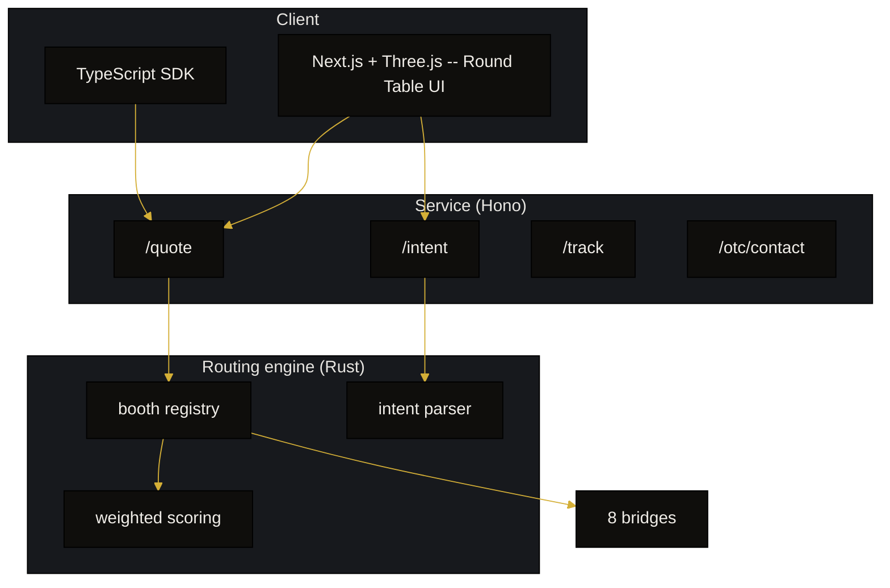

<p align="center">
  
</p>

<h1 align="center">DPLMT</h1>
<p align="center"><em>Every channel. One voice.</em></p>

<p align="center">
  <a href="https://dplmt.fun"></a>
  <a href="https://dplmt.fun/docs"></a>
  <a href="https://x.com/dplmt_fi"></a>
  
  
  
  
  
  
</p>

> **DPLMT** is the diplomatic round table of cross-chain liquidity. Eight booths reply at once.
> The diplomat stamps the cleanest signature under a gold seal.

## Table of Contents

- [What DPLMT does](#what-dplmt-does)
- [The Round Table](#the-round-table)
- [How to use the engine](#how-to-use-the-engine)
- [Architecture](#architecture)
- [Booths](#booths)
- [Intent dictation](#intent-dictation)
- [Scoring](#scoring)
- [Crates](#crates)
- [Roadmap](#roadmap)
- [Contributing](#contributing)
- [License](#license)

## What DPLMT does

DPLMT polls eight cross-chain bridges in parallel for a single transfer request:

- Wormhole, deBridge DLN, Mayan Swift, LayerZero Stargate
- Allbridge Core, Hyperlane Warp, Across, Synapse

Each bridge replies with a quote (amount out, finality, fee, slippage, security seal). The engine
folds the responses with a weighted score and exposes the winner per sort axis: `cheapest`,
`fastest`, `safest`, and `balanced`.

## The Round Table



## How to use the engine

```rust
use dplmt_router::{Engine, booth::QuoteRequest, chain::ChainId, scoring::SortMode};
use dplmt_router::bridges::{DebridgeBooth, MayanBooth, StargateBooth, AcrossBooth};
use std::sync::Arc;

#[tokio::main]
async fn main() -> anyhow::Result<()> {
    let booths: Vec<_> = vec![
        Arc::new(DebridgeBooth::new(None)),
        Arc::new(MayanBooth::new(None)),
        Arc::new(StargateBooth::new()),
        Arc::new(AcrossBooth::new()),
    ];
    let engine = Engine::new(booths);
    let req = QuoteRequest {
        from: ChainId::Solana,
        to: ChainId::Arbitrum,
        from_token: "USDC".into(),
        to_token: "USDC".into(),
        amount: 500.0,
        sender: None,
        recipient: None,
    };
    let cable = engine.open_channel(req, SortMode::Balanced).await?;
    if let Some(best) = cable.best {
        println!("diplomat picks: {:?}", best.balanced);
    }
    Ok(())
}
```

## Architecture

DPLMT splits the diplomatic stack into three layers:



## Booths

| Booth | Name | Seal | Source | Strengths |
|------:|------|:----:|:------:|-----------|
| I     | Wormhole       | A | Estimate | Battle-tested NTT / Portal lanes. Finality + gas modelled from protocol constants. |
| II    | deBridge DLN   | A | API | `dln.debridge.finance` solver-network quote |
| III   | Mayan Swift    | A | API | `price-api.mayan.finance` auction quote |
| IV    | Stargate (LZ)  | A | API | `stargate.finance/api/v1/quotes` bus or taxi |
| V     | Allbridge Core | B | API | `core.api.allbridgecoreapi.net` stable-channel calculator |
| VI    | Hyperlane Warp | B | Estimate | Warp-route oracle pricing modelled offline; long-tail chain coverage. |
| VII   | Across         | A | API | `app.across.to/api/suggested-fees` optimistic relayer |
| VIII  | Synapse        | B | API | `api.synapseprotocol.com/bridge` veteran route |

> **Source legend**: `API` means the booth's live public quote endpoint is
> hit on every request. `Estimate` means the engine models finality + fees
> from on-chain protocol constants rather than calling the SDK at request
> time. Both booth files document their behaviour in their doc-comments
> (`crates/router/src/bridges/*.rs`).

## Intent dictation

DPLMT accepts a natural-language cable and parses it into a structured `QuoteRequest`:

```rust
use dplmt_router::intent::parse_intent_regex;

let intent = parse_intent_regex("Send 250 USDC from Solana to Arbitrum, fastest please.");
assert!(intent.amount.unwrap_or_default() >= 250.0);
```

In production the service wraps Claude Haiku for higher recall, and falls back to the regex layer
above when the API is unavailable.

## Scoring

The scoring function normalises each quote across four axes and applies sort-mode weights:

```
score = w.amount   * (1 - amount_out / max(amount_out))
      + w.duration * (duration - min(duration)) / spread(duration)
      + w.security * (1 - security_weight)
      + w.slippage * slippage / max(slippage)
```

The diplomat picks the booth with the lowest score. Ties break on amount out.

## Crates

- [`crates/router`](crates/router/) -- Rust routing engine. `dplmt-router` crate.
- The web frontend (`dplmt-web`) and Hono service (`dplmt-service`) live in the private deployment
  repos. They consume `dplmt-router` either directly (Rust bindings) or via the parallel TypeScript
  implementation that mirrors the same scoring rules.

## Roadmap

- v0.6 -- Initial open-source release: 8 booths, scoring, intent regex parser, communique cards.
- v0.7 -- Push notifications, sealed OTC desk integrations, Hyperlane / Across hooks.
- v0.8 -- Multi-leg routes (split one transfer across two booths).
- v0.9 -- Solver auction layer for stable-to-stable pairs.

## Contributing

DPLMT welcomes contributions. Open an issue describing the booth, the lane, or the failure mode you
want to address. Code-of-conduct is "be a diplomat, not a courier."

## License

MIT. See [LICENSE](./LICENSE).
